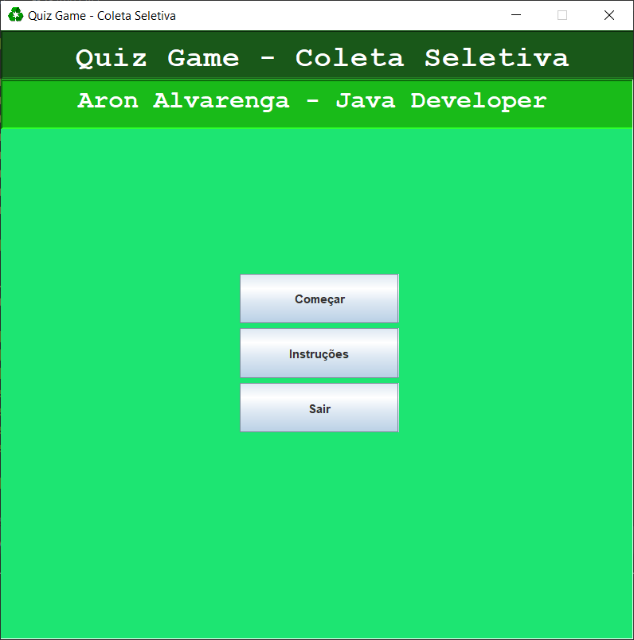
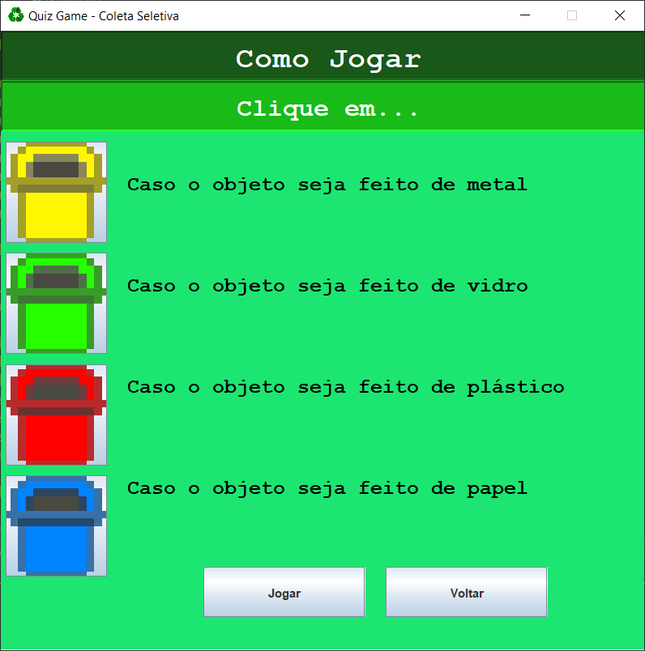
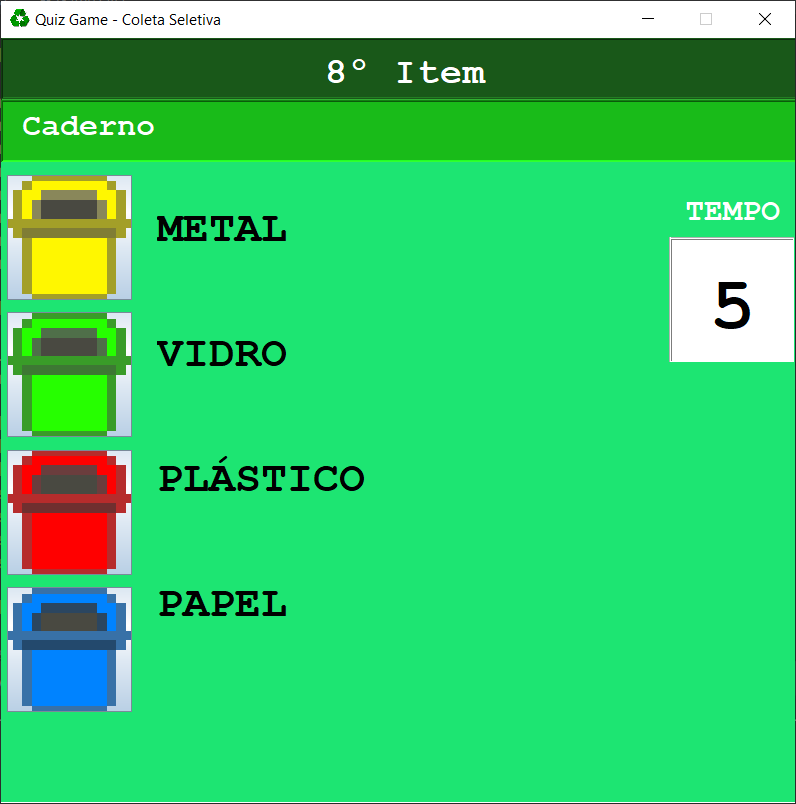
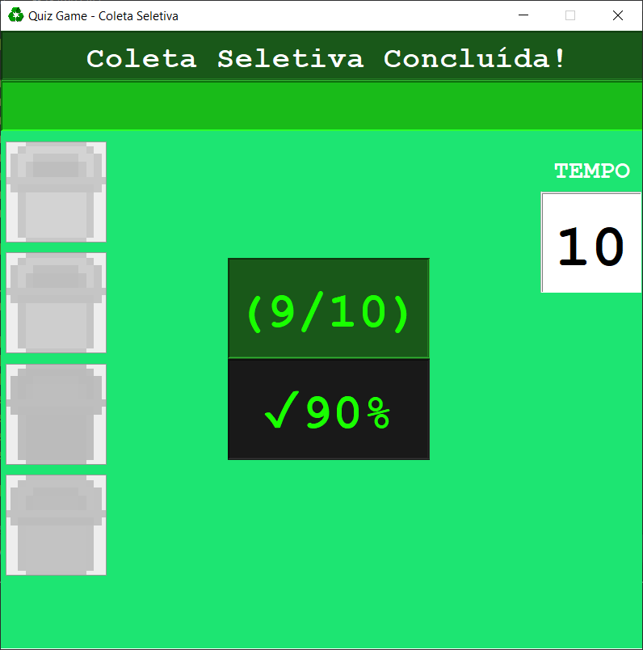

# 🕹️ Quiz Game feito em Java sobre Coleta Seletiva ♻️

Jogo em Java sobre coleta seletiva baseado no tutorial "[Java quiz game ⌛](https://www.youtube.com/watch?v=wk1Fbqh7Tew)" do canal do YouTube chamado "Bro Code".

## ⚙️ Informações adicionais

- Java na versão 9
- Eclipse IDE
- Piskel

## 🖼️ Imagens da aplicação

  
  

  
  
